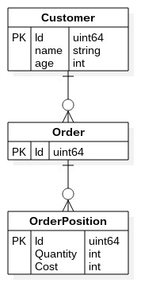

# Gondolier Example

Example for Gondolier: https://github.com/emvicom/gondolier

## Schema



## Run

```
cd gondolier-example
export GOPATH=`pwd`
go get github.com/emvicom/gondolier
go get github.com/lib/pq
go run src/main/main.go
```
